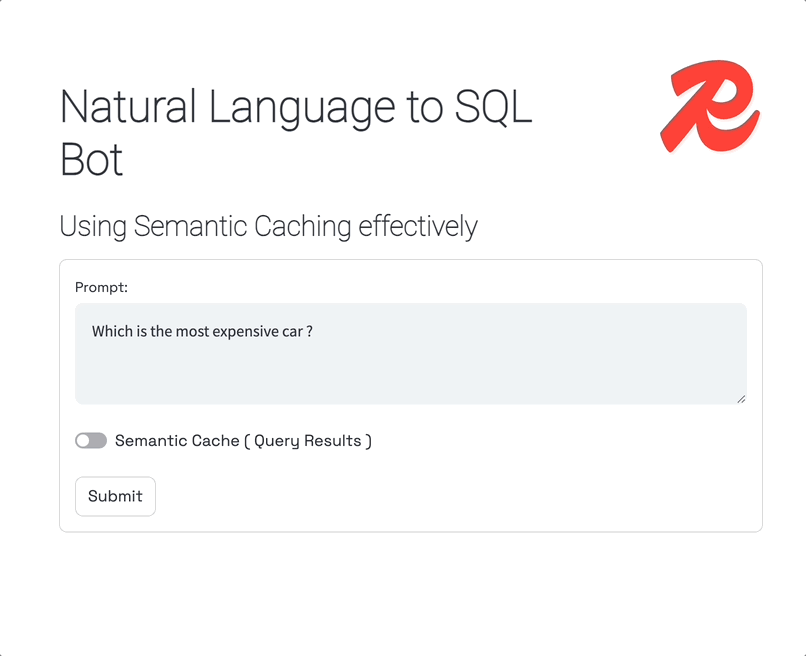
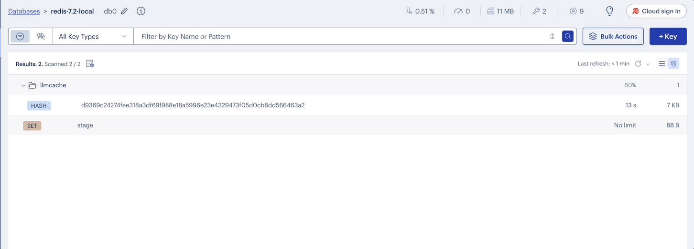

# text-sql-chatbot
Redis Database offers unique capability to keep your data fresh while serving through LLM chatbot

## Features in this demo

### Text to SQL generation based on the database



### Delivering results through semantic caching


### Data expiration after 15 seconds to keep cache fresh



## Project Setup

### Spin up a Redis instance enabled with RedisStack!

The easiest way to is to use a docker image using the below command
```bash
docker run -d -p 6379:6379 -p 8001:8001 redis/redis-stack:latest
```

If you do not want to use a docker image, you can sign up for a free Redis Cloud subscription [here](https://redis.com/try-free).

###  Set up the project

Download the repository

```
git clone https://github.com/mar1boroman/text-sql-chatbot.git && cd text-sql-chatbot
```

Prepare and activate the virtual environment

```
python3 -m venv venv && source venv/bin/activate
```

Install necessary libraries and dependencies

```
pip install -r requirements.txt
```

### Using the project

#### Update Config

Make sure you update the env file. You need a open ai api key  & a langsmith api key to update the config.
```
mv env_backup .env
```

```
vi .env
```

#### Load Data 

**Do not run if not required, below is just to show the workings**

```
python  data/load.py
```

This creates the cars_database.db (sqllite) database.

If you run this directly, you will get an error since the cars_database.db is already present and there will be unique key constraint violation

#### Run the app

```
python web/app.py
```
